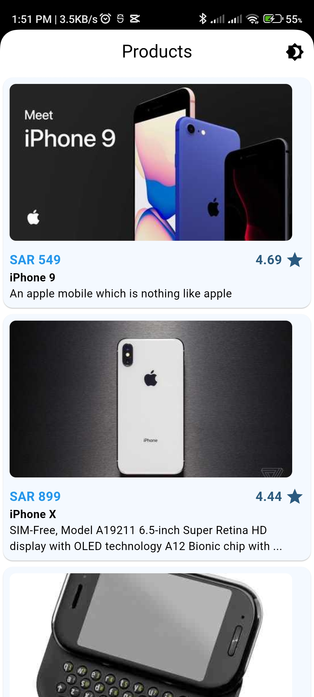
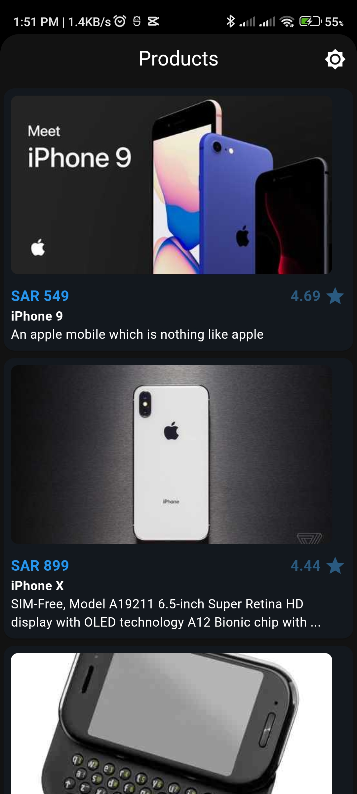

# E Commerce App

> A Flutter project.

## Features

- **Pagination:** Load and display data with pagination.
- **Pull-to-Refresh:** Implement a refresh mechanism for updated content.
- **Animated Deletion:** Enable smooth and interactive item deletion.
- **Caching for Offline Access:** Store data locally for offline usage.
- **Error Handling:** Implement error alerts for connection issues or failures.
- **Responsive Design:** Design UI elements to adapt to different screen sizes.
- **Clean Architecture:** Implement a modular and scalable architecture inspired by Clean Architecture principles.
- **Dio Interceptors:** Implement interceptors for logging and error handling with Dio package.
- **VPN Detection:** Detect VPN usage and display an error page if detected.
- **Animated List Actions:** Provide options for item deletion via swipe gestures or similar interactions.
- **Dynamic Loading:** Load more data as the user scrolls.

## Installation

To use this project, follow these steps:

1. Clone this repository.
2. Run `flutter pub get` in your terminal to fetch the dependencies.
3. Run `flutter run` to launch the application.

### Packages Used

This project utilizes the following packages:

- `cached_network_image: ^3.3.1`
- `connectivity_plus: ^5.0.2`
- `flutter_riverpod: ^2.4.9`
- `dio: ^5.4.0`
- `go_router: ^13.0.1`
- `shared_preferences: ^2.2.2`

## Screenshots

<table>
  <tr>
    <td style="text-align: center;">
      
      
Light Mode

    </td>
    <td style="text-align: center;">
      
      
Dark Mode

    </td>
  </tr>
</table>

## Contributing

